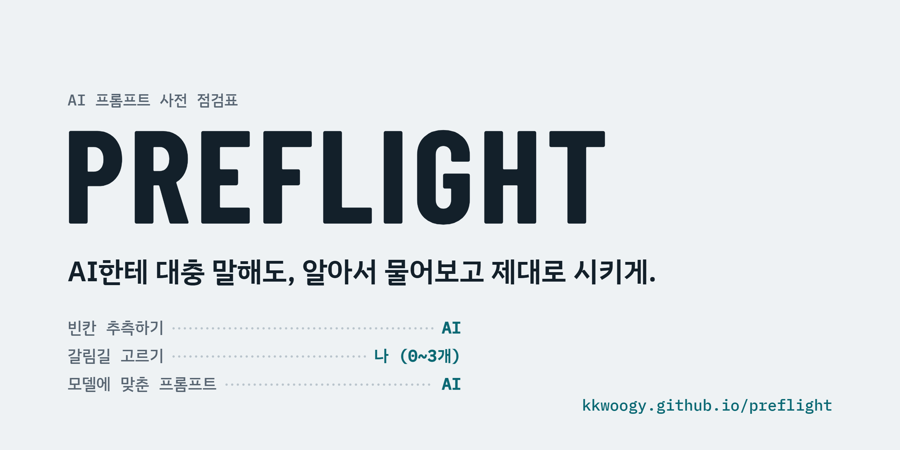

<picture>
  <source media="(prefers-color-scheme: dark)" srcset="assets/banner-dark.png">
  
</picture>

### [→ 웹 페이지에서 바로 써보기](https://kkwoogy.github.io/preflight/)

AI가 똑똑해도 "잘" 쓰기는 어렵다. 어떤 도구와 모델을 어떻게 써야 할지 모르고, 원하는 걸 타이핑으로 다 설명하기는 피곤하다. Preflight는 내가 이미 쓰는 AI(ChatGPT, Claude, Gemini, Perplexity 등) 앞에 끼우는 **입구**다. 새로운 AI가 아니다.

## 어떻게 동작하나

> **묻기 전에 추측하고, 추측을 보여주고, 갈리는 것만 묻고, 나머지는 보고 고치게 한다.**

| 단계 | 누가 | 내용 |
|---|---|---|
| 추측 | AI | 결과물, 독자, 분량, 말투, 넣을 AI 등 빈칸을 AI가 먼저 채운다 |
| 되말하기 | AI | "이렇게 이해했어요" 3~4줄. 사용자는 틀린 곳만 고친다 |
| 갈림길 | 사용자 | 결과가 크게 갈리는데 AI가 추측하기 어려운 것만 0~3개 고른다. 늘 "잘 모르겠어, 추천해줘"가 있다 |
| 최종 프롬프트 | AI | 고른 AI·모델의 공식 가이드에 맞춘 형식으로 쓰고, 품질 점검을 거친다 |
| 고치기 | 사용자 | 결과를 보고 "좋아 / 조금 고칠래 / 방향이 달라" |

예를 들어 "환경 수업 기말 보고서 써줘, ChatGPT Thinking에서 쓸 거야"라고 하면, 질문 2개에 "1A 2B"로 답하는 것만으로 장별 글자 수, 출처 규칙, 성공 기준까지 들어간 프롬프트가 나온다.

## 쓰는 법

1. **웹 페이지**: 쓰는 AI와 모델을 고르고 시작 프롬프트를 복사해서, 그 AI의 새 대화나 프로젝트 지침에 붙여넣는다.
2. **스킬로 설치**: 새 대화를 열어도 계속 켜져 있다.
   - Claude: `skills/run-preflight` 폴더를 zip으로 압축해서 Settings → Customize → Skills에 올린다.
   - Gemini: `skills/run-preflight/SKILL.md`를 Skills에 올린다 (만 18세 이상, 개인 계정).
3. **Claude Code**: `claude-code/preflight` 폴더를 `~/.claude/skills/`에 복사한 다음 `/preflight`를 입력한다. 화이트보드, 슬라이더, 서브에이전트를 이용한 품질 점검까지 쓰는 전체 버전이다.

## 왜 이렇게 만들었나

| 원칙 | 근거 |
|---|---|
| 묻기 전에 추측 — 노력은 AI 쪽으로 | 최소 공동 노력 원리 (Clark & Brennan, 1991) |
| 갈리는 것만 묻기 | 질문의 기대 효용 (Horvitz, CHI 1999), Uncertainty of Thoughts (NeurIPS 2024) |
| 쓰게 말고 고르게 | GATE (ICLR 2025): AI가 질문해서 끌어낸 선호가 직접 쓴 프롬프트보다 정보가 많고 덜 힘들었다 |
| 모호하면 보여주기 | 미디어 풍부성 이론 (Daft & Lengel, 1986), DirectGPT (CHI 2024) |
| 되말하기 | Teach-back 체계적 리뷰 (2020) |
| 피로 신호에 멈추기 | 설문 길이와 응답 품질 (Galesic & Bosnjak, 2009) |
| 모델마다 다른 형식 | 형식 민감도 (Sclar 외, ICLR 2024), 각 회사 공식 프롬프트 가이드 |

자세한 내용과 링크는 [`claude-code/preflight/why.md`](claude-code/preflight/why.md), 모델별 규칙은 [`claude-code/preflight/targets.md`](claude-code/preflight/targets.md)에 있다.

## 만든 과정

1. **문제 정의**: AI를 잘 쓰기 어려운 이유를 "뭘 써야 할지 모름"과 "설명하기 피곤함" 두 가지로 나눴다. HCI 연구에서는 이를 Gulf of Envisioning이라고 부른다.
2. **사례 조사**: 음성 입력, AI 포인터, 인터뷰형 스킬, Lovable Plan Mode, 시연으로 가르치기, 생성형 UI 등을 살폈다. 조각은 다 있지만, 준비물을 한 번에 처리하고 "모르겠어 → 추천"을 기본으로 두는 조합은 찾지 못했다.
3. **v1 — 인터뷰형**: 질문을 꼼꼼히 하는 방식으로 만들었다. 그러자 질문이 많아 다시 피곤해지는 문제가 생겼다.
4. **연구 조사**: 의사소통, HCI, 설문 방법론 연구를 찾아보고 "인터뷰 먼저"를 "추측 먼저"로 뒤집었다 (v3).
5. **여러 AI 지원**: 각 회사의 2026년 10월 기준 공식 가이드를 조사해 모델별 규칙표를 만들었다. Claude 밖에서도 돌아가는 이식용 버전을 만들었다.
6. **시험과 수정**: 다른 AI에게 ChatGPT 역할을 맡겨 시험했다. 거기서 나온 애매한 지시 5곳을 고쳤다.

## 폴더 구조

```
index.html                     웹 페이지 (AI·모델 선택 → 시작 프롬프트 / 스킬 파일)
assets/                        배너 이미지 (라이트·다크)
skills/starter-prompt.md       아무 AI에 붙여넣는 시작 프롬프트
skills/run-preflight/SKILL.md  여러 AI용 스킬 (Gemini Skills, Claude)
claude-code/preflight/         Claude Code 전체 버전 (규칙표, 입력 방식, 슬라이더, 근거 포함)
```

## 한계

- 모델별 규칙은 2026-10-04에 확인했다. 모델 이름과 메뉴는 자주 바뀐다. 공식 문서로 확인하지 못한 부분은 "(비공식)"으로 표시했다.
- 실제 ChatGPT·Gemini에서의 실전 테스트는 진행 중이다.
